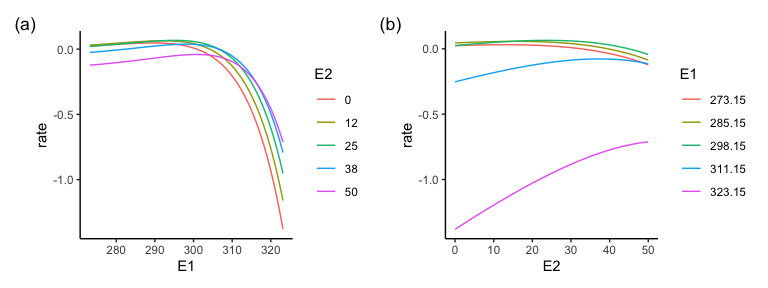
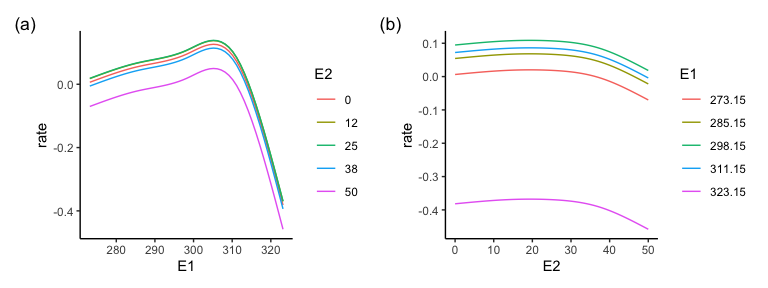
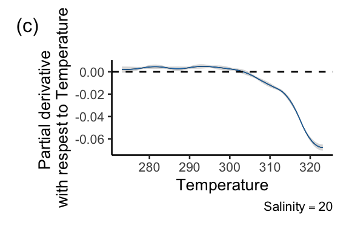
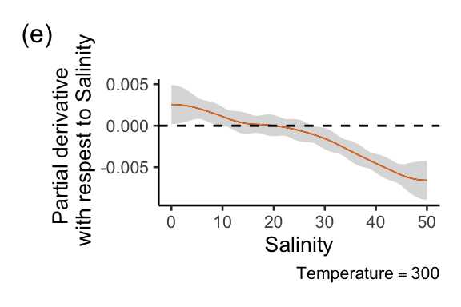

# Introduction

Researchers have previous suggested that the response diversity of a
community be measured by the diversity of responses to environmental
change. For example, one can measure the response of each of the
species' intrinsic growth rate to temperature, quantify the strength and
direction of these responses (e.g., as the first derivative of the
response curve), and calculate the diversity of responses (e.g., by
calculating variation in the first derivatives among the species in a
community). When responses are nonlinear, the response diversity will be
a function of the environmental state (i.e. the first derivative is a
function of the value of the environmental state). So far we
demonstrated this approach for quantifying response diversity in the
context of a single environmental factor, but given that multiple
environmental factors can change simultaneously, we need an approach
that works in that context.


# The principle

*To learn about the mathematical principles watch these youtube videos:*

-   [Surfaces and Partial
    Derivatives](https://www.youtube.com/watch?v=k4wNIZr8GU4)
-   [54. Slope of the Surface in Any Direction - Directional Derivative,
    and Properties of the
    Gradient](https://www.youtube.com/watch?v=wfjipWmyRYg)

Imagine that the growth rate of a population depends on two
environmental factors, e.g. temperature and salinity. We can represent
the dependency as $G = f(T, S)$, where $G$ is growth rate, $T$ is
temperature, and $S$ is salinity. It may be that the dependencies are
linear, nonlinear, and with an interaction between temperature and
salinity, hence our approach needs to be able to accommodate this
phenomena.

The response of growth rate to change in temperature and salinity is the
gradient / slope of this surface, with units of growth rate [per time]
per temperature [degrees C] per salinity [parts per thousand]. Because
the slope (first derivative) of the surface can (when dependencies are
nonlinear) vary across the surface (location on the surface), and can
vary in different directions on the surface, to calculate a slope we
must specify the current environment (location on the surface) and the
trajectory of change in the environment. The location on the curve is the
current environmental condition, $(T_0, S_0)$, and the trajectory of
environmental change is the unit vector
$\hat{u} = \langle U_T, U_S \rangle$.

Put another way, we calculate a directional derivative at a point on the
response surface. We can write this as $D_{\hat{u}}f(T_0, S_0)$ and can
calculate it as $f_T(T_0, S_0)U_T + f_S(T_0, S_0)U_S$, where $f_T$ is
the partial derivative of $f(T, S)$ with respect to $T$ and $f_S$ is the
partial derivative of $f(T, S)$ with respect to $S$.

Efficient evaluating in $n$ dimensions can be done by taking the dot
product of the partial derivatives at the location and the direction
unit vector: $D_{\hat{u}}f(T_0, S_0) = \triangledown f \cdot \hat{u}$
where, $\triangledown f = \langle f_T, f_S \rangle$. (In R, the dot
product of `a` and `b` is `sum(a*b)`)

Figure \@ref(fig:surface-sketch) is an illustration of the principle of
directional derivatives on a surface.


<div class="figure" style="text-align: center">

<p class="caption">(\#fig:surface-sketch)Response surface and principle illustration</p>
</div>

# A simulated empirical example

Numerous mathematical functions have been used to represent how
organismal performance changes with an environmental driver.
Moreover, multiple mathematical functions have been used to
represent an interactive effect of two or more environmental drivers on
species performance [e.g. Thomas et al
2017](https://onlinelibrary.wiley.com/doi/full/10.1111/gcb.13641). 

## Simulating performance curves

Let us use the Eppley performance curve, which was used, for example, in
this paper [Bernhardt et al.
2018](https://royalsocietypublishing.org/doi/10.1098/rspb.2018.1076).

With one environmental variable, the performance (i.e., rate) is given
by:

-   $rate(E) = ae^{bE}(1 - (\frac{E - z}{w/2})^2)$
-   $E$ is the values of the environmental factor.
-   $z$ controls location of maximum.
-   $w$ controls range of $E$ over which the rate is positive.
-   $a$ scaling constant.
-   $b$ controls rate of increase towards the maximum rate, as $E$
    increases.

Adding a second environmental variable gives:

$rate(E_1, E_2) = a_1e^{b_1E_1}(1 - (\frac{E_1 - z_1}{w_1/2})^2) + a_2e^{b_2E_2}(1 - (\frac{E_2 - z_2}{w_2/2})^2)$

In this case, it is clear the effect of $E_1$ and $E_2$ is defined as
being additive. For example, the value of $E_2$ does not affect the
value of $E_1$ at which the rate is maximised ($z_1$), and vice-versa.


 


*Including an interaction*. One way to do this is to make the value of
$E_1$ at which the rate is maximised depend on the value of $E_2$:

$rate(E_1, E_2) = a_1e^{b_1E_1}(1 - (\frac{(E_1 + z_{int21}*E_2- z_1)}{w_1/2})^2 + a_2e^{b_2E_2}(1 - (\frac{E_2 - z_2}{w_2/2})^2$

When $z_{int21} = 0$ then this equation becomes the previously mentioned
additive one. When $z_{int} \neq 0$ then the value of $E_1$ at which the
rate is maximised is a function of the value of $E_2$. We used this
method for adding an interaction due to its simplicity. Other methods
could be used, and if also or otherwise used could add confidence about
the robustness of the method for calculating response diversity.


## Simulating multiple species' performance curves

### No interacting environmental effects

First we create (or import) a table of parameter values of each species,
with species in the rows and parameters in the columns. In the following
example, only values of the $z$ parameters differ among the species
(which determine the location of the maximum rate).


```{=html}
<div class="datatables html-widget html-fill-item" id="htmlwidget-801c52c2c787a968772a" style="width:100%;height:auto;"></div>
<script type="application/json" data-for="htmlwidget-801c52c2c787a968772a">{"x":{"filter":"top","vertical":false,"filterHTML":"<tr>\n  <td><\/td>\n  <td data-type=\"number\" style=\"vertical-align: top;\">\n    <div class=\"form-group has-feedback\" style=\"margin-bottom: auto;\">\n      <input type=\"search\" placeholder=\"All\" class=\"form-control\" style=\"width: 100%;\" disabled=\"\"/>\n      <span class=\"glyphicon glyphicon-remove-circle form-control-feedback\"><\/span>\n    <\/div>\n    <div style=\"display: none;position: absolute;width: 200px;opacity: 1\">\n      <div data-min=\"0\" data-max=\"1\" data-scale=\"9\"><\/div>\n      <span style=\"float: left;\"><\/span>\n      <span style=\"float: right;\"><\/span>\n    <\/div>\n  <\/td>\n  <td data-type=\"number\" style=\"vertical-align: top;\">\n    <div class=\"form-group has-feedback\" style=\"margin-bottom: auto;\">\n      <input type=\"search\" placeholder=\"All\" class=\"form-control\" style=\"width: 100%;\" disabled=\"\"/>\n      <span class=\"glyphicon glyphicon-remove-circle form-control-feedback\"><\/span>\n    <\/div>\n    <div style=\"display: none;position: absolute;width: 200px;opacity: 1\">\n      <div data-min=\"0\" data-max=\"1\" data-scale=\"3\"><\/div>\n      <span style=\"float: left;\"><\/span>\n      <span style=\"float: right;\"><\/span>\n    <\/div>\n  <\/td>\n  <td data-type=\"number\" style=\"vertical-align: top;\">\n    <div class=\"form-group has-feedback\" style=\"margin-bottom: auto;\">\n      <input type=\"search\" placeholder=\"All\" class=\"form-control\" style=\"width: 100%;\"/>\n      <span class=\"glyphicon glyphicon-remove-circle form-control-feedback\"><\/span>\n    <\/div>\n    <div style=\"display: none;position: absolute;width: 200px;opacity: 1\">\n      <div data-min=\"270.084014022723\" data-max=\"296.871775598265\" data-scale=\"13\"><\/div>\n      <span style=\"float: left;\"><\/span>\n      <span style=\"float: right;\"><\/span>\n    <\/div>\n  <\/td>\n  <td data-type=\"number\" style=\"vertical-align: top;\">\n    <div class=\"form-group has-feedback\" style=\"margin-bottom: auto;\">\n      <input type=\"search\" placeholder=\"All\" class=\"form-control\" style=\"width: 100%;\" disabled=\"\"/>\n      <span class=\"glyphicon glyphicon-remove-circle form-control-feedback\"><\/span>\n    <\/div>\n    <div style=\"display: none;position: absolute;width: 200px;opacity: 1\">\n      <div data-min=\"0\" data-max=\"1\"><\/div>\n      <span style=\"float: left;\"><\/span>\n      <span style=\"float: right;\"><\/span>\n    <\/div>\n  <\/td>\n  <td data-type=\"number\" style=\"vertical-align: top;\">\n    <div class=\"form-group has-feedback\" style=\"margin-bottom: auto;\">\n      <input type=\"search\" placeholder=\"All\" class=\"form-control\" style=\"width: 100%;\" disabled=\"\"/>\n      <span class=\"glyphicon glyphicon-remove-circle form-control-feedback\"><\/span>\n    <\/div>\n    <div style=\"display: none;position: absolute;width: 200px;opacity: 1\">\n      <div data-min=\"0\" data-max=\"1\" data-scale=\"3\"><\/div>\n      <span style=\"float: left;\"><\/span>\n      <span style=\"float: right;\"><\/span>\n    <\/div>\n  <\/td>\n  <td data-type=\"number\" style=\"vertical-align: top;\">\n    <div class=\"form-group has-feedback\" style=\"margin-bottom: auto;\">\n      <input type=\"search\" placeholder=\"All\" class=\"form-control\" style=\"width: 100%;\" disabled=\"\"/>\n      <span class=\"glyphicon glyphicon-remove-circle form-control-feedback\"><\/span>\n    <\/div>\n    <div style=\"display: none;position: absolute;width: 200px;opacity: 1\">\n      <div data-min=\"0\" data-max=\"1\" data-scale=\"2\"><\/div>\n      <span style=\"float: left;\"><\/span>\n      <span style=\"float: right;\"><\/span>\n    <\/div>\n  <\/td>\n  <td data-type=\"number\" style=\"vertical-align: top;\">\n    <div class=\"form-group has-feedback\" style=\"margin-bottom: auto;\">\n      <input type=\"search\" placeholder=\"All\" class=\"form-control\" style=\"width: 100%;\"/>\n      <span class=\"glyphicon glyphicon-remove-circle form-control-feedback\"><\/span>\n    <\/div>\n    <div style=\"display: none;position: absolute;width: 200px;opacity: 1\">\n      <div data-min=\"10.0129270693287\" data-max=\"26.7779199965298\" data-scale=\"14\"><\/div>\n      <span style=\"float: left;\"><\/span>\n      <span style=\"float: right;\"><\/span>\n    <\/div>\n  <\/td>\n  <td data-type=\"number\" style=\"vertical-align: top;\">\n    <div class=\"form-group has-feedback\" style=\"margin-bottom: auto;\">\n      <input type=\"search\" placeholder=\"All\" class=\"form-control\" style=\"width: 100%;\" disabled=\"\"/>\n      <span class=\"glyphicon glyphicon-remove-circle form-control-feedback\"><\/span>\n    <\/div>\n    <div style=\"display: none;position: absolute;width: 200px;opacity: 1\">\n      <div data-min=\"0\" data-max=\"1\"><\/div>\n      <span style=\"float: left;\"><\/span>\n      <span style=\"float: right;\"><\/span>\n    <\/div>\n  <\/td>\n  <td data-type=\"number\" style=\"vertical-align: top;\">\n    <div class=\"form-group has-feedback\" style=\"margin-bottom: auto;\">\n      <input type=\"search\" placeholder=\"All\" class=\"form-control\" style=\"width: 100%;\" disabled=\"\"/>\n      <span class=\"glyphicon glyphicon-remove-circle form-control-feedback\"><\/span>\n    <\/div>\n    <div style=\"display: none;position: absolute;width: 200px;opacity: 1\">\n      <div data-min=\"0\" data-max=\"1\"><\/div>\n      <span style=\"float: left;\"><\/span>\n      <span style=\"float: right;\"><\/span>\n    <\/div>\n  <\/td>\n  <td data-type=\"number\" style=\"vertical-align: top;\">\n    <div class=\"form-group has-feedback\" style=\"margin-bottom: auto;\">\n      <input type=\"search\" placeholder=\"All\" class=\"form-control\" style=\"width: 100%;\" disabled=\"\"/>\n      <span class=\"glyphicon glyphicon-remove-circle form-control-feedback\"><\/span>\n    <\/div>\n    <div style=\"display: none;position: absolute;width: 200px;opacity: 1\">\n      <div data-min=\"0\" data-max=\"1\"><\/div>\n      <span style=\"float: left;\"><\/span>\n      <span style=\"float: right;\"><\/span>\n    <\/div>\n  <\/td>\n<\/tr>","data":[["1","2","3","4","5","6","7","8","9","10"],[1e-09,1e-09,1e-09,1e-09,1e-09,1e-09,1e-09,1e-09,1e-09,1e-09],[0.063,0.063,0.063,0.063,0.063,0.063,0.063,0.063,0.063,0.063],[270.0840140227228,277.0911623351276,290.8805276826024,286.0165206925012,294.4974396913312,291.0067399148829,281.938274691347,294.50001725927,296.8717755982652,272.5634251185693],[60,60,60,60,60,60,60,60,60,60],[0.001,0.001,0.001,0.001,0.001,0.001,0.001,0.001,0.001,0.001],[0.02,0.02,0.02,0.02,0.02,0.02,0.02,0.02,0.02,0.02],[22.43456760421395,16.46992172580212,10.01292706932873,24.24311844166368,16.17267773486674,25.73636558372527,26.77791999652982,15.46716617885977,23.17856966517866,20.36314472556114],[10,10,10,10,10,10,10,10,10,10],[0,0,0,0,0,0,0,0,0,0],[0,0,0,0,0,0,0,0,0,0]],"container":"<table class=\"display\">\n  <thead>\n    <tr>\n      <th> <\/th>\n      <th>a1<\/th>\n      <th>b1<\/th>\n      <th>z1<\/th>\n      <th>w1<\/th>\n      <th>a2<\/th>\n      <th>b2<\/th>\n      <th>z2<\/th>\n      <th>w2<\/th>\n      <th>z_int21<\/th>\n      <th>sd_rate<\/th>\n    <\/tr>\n  <\/thead>\n<\/table>","options":{"columnDefs":[{"className":"dt-right","targets":[1,2,3,4,5,6,7,8,9,10]},{"orderable":false,"targets":0},{"name":" ","targets":0},{"name":"a1","targets":1},{"name":"b1","targets":2},{"name":"z1","targets":3},{"name":"w1","targets":4},{"name":"a2","targets":5},{"name":"b2","targets":6},{"name":"z2","targets":7},{"name":"w2","targets":8},{"name":"z_int21","targets":9},{"name":"sd_rate","targets":10}],"order":[],"autoWidth":false,"orderClasses":false,"orderCellsTop":true}},"evals":[],"jsHooks":[]}</script>
```

For convenience we then convert the table of parameters into a
[list-column](https://dcl-prog.stanford.edu/list-columns.html). We can
then easily make performance curves of each of the species, and put
those into a list-column in the same table.


``` r
## convert parameter table to a list-column of a tibble
par_list <- Partable_2_parlist(par_table)
## add performance curves
species_pars <- tibble(species = paste0("s", 1:s), pars = par_list) %>%
  rowwise() %>%
  mutate(expt = Make_expt(E1_series, E2_series, pars))
```

Here are some examples of the species' performance curves (only with
additive effects of $E_1$ and $E_2$).

 

<div class="figure" style="text-align: center">

<p class="caption">(\#fig:lowE1-opt-species)Performance curves for a species with maximum growth at **low** values of $E_1$. Without interacting environmental effects.</p>
</div>


<div class="figure" style="text-align: center">

<p class="caption">(\#fig:highE1-opt-species) Performance curves for a species with maximum growth at **high** values of $E_1$. Without interacting environmental effects.</p>
</div>


<div class="figure" style="text-align: center">

<p class="caption">(\#fig:lowE2-opt-species)Performance curves for a species with maximum growth at **low** values of $E_2$. Without interacting environmental effects.</p>
</div>


<div class="figure" style="text-align: center">

<p class="caption">(\#fig:highE2-opt-species)Performance curves for a species with maximum growth at **high** values of $E_2$. Without interacting environmental effects.</p>
</div>

### Interacting environmental effects

And now with interacting environmental effects...


```{=html}
<div class="datatables html-widget html-fill-item" id="htmlwidget-72c825a07bae6269aded" style="width:100%;height:auto;"></div>
<script type="application/json" data-for="htmlwidget-72c825a07bae6269aded">{"x":{"filter":"top","vertical":false,"filterHTML":"<tr>\n  <td><\/td>\n  <td data-type=\"number\" style=\"vertical-align: top;\">\n    <div class=\"form-group has-feedback\" style=\"margin-bottom: auto;\">\n      <input type=\"search\" placeholder=\"All\" class=\"form-control\" style=\"width: 100%;\" disabled=\"\"/>\n      <span class=\"glyphicon glyphicon-remove-circle form-control-feedback\"><\/span>\n    <\/div>\n    <div style=\"display: none;position: absolute;width: 200px;opacity: 1\">\n      <div data-min=\"0\" data-max=\"1\" data-scale=\"9\"><\/div>\n      <span style=\"float: left;\"><\/span>\n      <span style=\"float: right;\"><\/span>\n    <\/div>\n  <\/td>\n  <td data-type=\"number\" style=\"vertical-align: top;\">\n    <div class=\"form-group has-feedback\" style=\"margin-bottom: auto;\">\n      <input type=\"search\" placeholder=\"All\" class=\"form-control\" style=\"width: 100%;\" disabled=\"\"/>\n      <span class=\"glyphicon glyphicon-remove-circle form-control-feedback\"><\/span>\n    <\/div>\n    <div style=\"display: none;position: absolute;width: 200px;opacity: 1\">\n      <div data-min=\"0\" data-max=\"1\" data-scale=\"3\"><\/div>\n      <span style=\"float: left;\"><\/span>\n      <span style=\"float: right;\"><\/span>\n    <\/div>\n  <\/td>\n  <td data-type=\"number\" style=\"vertical-align: top;\">\n    <div class=\"form-group has-feedback\" style=\"margin-bottom: auto;\">\n      <input type=\"search\" placeholder=\"All\" class=\"form-control\" style=\"width: 100%;\"/>\n      <span class=\"glyphicon glyphicon-remove-circle form-control-feedback\"><\/span>\n    <\/div>\n    <div style=\"display: none;position: absolute;width: 200px;opacity: 1\">\n      <div data-min=\"271.357648316771\" data-max=\"295.299732657149\" data-scale=\"13\"><\/div>\n      <span style=\"float: left;\"><\/span>\n      <span style=\"float: right;\"><\/span>\n    <\/div>\n  <\/td>\n  <td data-type=\"number\" style=\"vertical-align: top;\">\n    <div class=\"form-group has-feedback\" style=\"margin-bottom: auto;\">\n      <input type=\"search\" placeholder=\"All\" class=\"form-control\" style=\"width: 100%;\" disabled=\"\"/>\n      <span class=\"glyphicon glyphicon-remove-circle form-control-feedback\"><\/span>\n    <\/div>\n    <div style=\"display: none;position: absolute;width: 200px;opacity: 1\">\n      <div data-min=\"0\" data-max=\"1\"><\/div>\n      <span style=\"float: left;\"><\/span>\n      <span style=\"float: right;\"><\/span>\n    <\/div>\n  <\/td>\n  <td data-type=\"number\" style=\"vertical-align: top;\">\n    <div class=\"form-group has-feedback\" style=\"margin-bottom: auto;\">\n      <input type=\"search\" placeholder=\"All\" class=\"form-control\" style=\"width: 100%;\" disabled=\"\"/>\n      <span class=\"glyphicon glyphicon-remove-circle form-control-feedback\"><\/span>\n    <\/div>\n    <div style=\"display: none;position: absolute;width: 200px;opacity: 1\">\n      <div data-min=\"0\" data-max=\"1\" data-scale=\"3\"><\/div>\n      <span style=\"float: left;\"><\/span>\n      <span style=\"float: right;\"><\/span>\n    <\/div>\n  <\/td>\n  <td data-type=\"number\" style=\"vertical-align: top;\">\n    <div class=\"form-group has-feedback\" style=\"margin-bottom: auto;\">\n      <input type=\"search\" placeholder=\"All\" class=\"form-control\" style=\"width: 100%;\" disabled=\"\"/>\n      <span class=\"glyphicon glyphicon-remove-circle form-control-feedback\"><\/span>\n    <\/div>\n    <div style=\"display: none;position: absolute;width: 200px;opacity: 1\">\n      <div data-min=\"0\" data-max=\"1\" data-scale=\"2\"><\/div>\n      <span style=\"float: left;\"><\/span>\n      <span style=\"float: right;\"><\/span>\n    <\/div>\n  <\/td>\n  <td data-type=\"number\" style=\"vertical-align: top;\">\n    <div class=\"form-group has-feedback\" style=\"margin-bottom: auto;\">\n      <input type=\"search\" placeholder=\"All\" class=\"form-control\" style=\"width: 100%;\"/>\n      <span class=\"glyphicon glyphicon-remove-circle form-control-feedback\"><\/span>\n    <\/div>\n    <div style=\"display: none;position: absolute;width: 200px;opacity: 1\">\n      <div data-min=\"11.0968862567097\" data-max=\"27.2984294313937\" data-scale=\"14\"><\/div>\n      <span style=\"float: left;\"><\/span>\n      <span style=\"float: right;\"><\/span>\n    <\/div>\n  <\/td>\n  <td data-type=\"number\" style=\"vertical-align: top;\">\n    <div class=\"form-group has-feedback\" style=\"margin-bottom: auto;\">\n      <input type=\"search\" placeholder=\"All\" class=\"form-control\" style=\"width: 100%;\" disabled=\"\"/>\n      <span class=\"glyphicon glyphicon-remove-circle form-control-feedback\"><\/span>\n    <\/div>\n    <div style=\"display: none;position: absolute;width: 200px;opacity: 1\">\n      <div data-min=\"0\" data-max=\"1\"><\/div>\n      <span style=\"float: left;\"><\/span>\n      <span style=\"float: right;\"><\/span>\n    <\/div>\n  <\/td>\n  <td data-type=\"number\" style=\"vertical-align: top;\">\n    <div class=\"form-group has-feedback\" style=\"margin-bottom: auto;\">\n      <input type=\"search\" placeholder=\"All\" class=\"form-control\" style=\"width: 100%;\"/>\n      <span class=\"glyphicon glyphicon-remove-circle form-control-feedback\"><\/span>\n    <\/div>\n    <div style=\"display: none;position: absolute;width: 200px;opacity: 1\">\n      <div data-min=\"-0.242164493335918\" data-max=\"-0.1396200451061\" data-scale=\"15\"><\/div>\n      <span style=\"float: left;\"><\/span>\n      <span style=\"float: right;\"><\/span>\n    <\/div>\n  <\/td>\n  <td data-type=\"number\" style=\"vertical-align: top;\">\n    <div class=\"form-group has-feedback\" style=\"margin-bottom: auto;\">\n      <input type=\"search\" placeholder=\"All\" class=\"form-control\" style=\"width: 100%;\" disabled=\"\"/>\n      <span class=\"glyphicon glyphicon-remove-circle form-control-feedback\"><\/span>\n    <\/div>\n    <div style=\"display: none;position: absolute;width: 200px;opacity: 1\">\n      <div data-min=\"0\" data-max=\"1\"><\/div>\n      <span style=\"float: left;\"><\/span>\n      <span style=\"float: right;\"><\/span>\n    <\/div>\n  <\/td>\n<\/tr>","data":[["1","2","3","4","5","6","7","8","9","10"],[1e-09,1e-09,1e-09,1e-09,1e-09,1e-09,1e-09,1e-09,1e-09,1e-09],[0.063,0.063,0.063,0.063,0.063,0.063,0.063,0.063,0.063,0.063],[288.3548494032584,271.3576483167708,286.3001320743933,272.1065990324132,284.9350237450562,279.786555566825,295.2997326571494,288.7897690641694,274.4790320307948,280.4067178932019],[60,60,60,60,60,60,60,60,60,60],[0.001,0.001,0.001,0.001,0.001,0.001,0.001,0.001,0.001,0.001],[0.02,0.02,0.02,0.02,0.02,0.02,0.02,0.02,0.02,0.02],[27.06988717895001,12.60907350108027,21.76479984074831,21.33847609162331,25.31842658761889,27.29842943139374,11.09688625670969,13.99729071650654,27.27455640211701,18.33161390386522],[10,10,10,10,10,10,10,10,10,10],[-0.2016422196385337,-0.2285076291670147,-0.2174869779064336,-0.1396200451061001,-0.1835694195781805,-0.1800884709868218,-0.2108279609970924,-0.2290171280622909,-0.2421644933359179,-0.1803280442100247],[0,0,0,0,0,0,0,0,0,0]],"container":"<table class=\"display\">\n  <thead>\n    <tr>\n      <th> <\/th>\n      <th>a1<\/th>\n      <th>b1<\/th>\n      <th>z1<\/th>\n      <th>w1<\/th>\n      <th>a2<\/th>\n      <th>b2<\/th>\n      <th>z2<\/th>\n      <th>w2<\/th>\n      <th>z_int21<\/th>\n      <th>sd_rate<\/th>\n    <\/tr>\n  <\/thead>\n<\/table>","options":{"columnDefs":[{"className":"dt-right","targets":[1,2,3,4,5,6,7,8,9,10]},{"orderable":false,"targets":0},{"name":" ","targets":0},{"name":"a1","targets":1},{"name":"b1","targets":2},{"name":"z1","targets":3},{"name":"w1","targets":4},{"name":"a2","targets":5},{"name":"b2","targets":6},{"name":"z2","targets":7},{"name":"w2","targets":8},{"name":"z_int21","targets":9},{"name":"sd_rate","targets":10}],"order":[],"autoWidth":false,"orderClasses":false,"orderCellsTop":true}},"evals":[],"jsHooks":[]}</script>
```

For convenience we then convert the table of parameters into a
[list-column](https://dcl-prog.stanford.edu/list-columns.html). We can
then easily make performance curves of each of the species, and put
those into a list-column in the same table.


``` r
## convert parameter table to a list-column of a tibble
par_list <- Partable_2_parlist(par_table)
## add performance curves
species_pars <- tibble(species = paste0("s", 1:s), pars = par_list) %>%
  rowwise() %>%
  mutate(expt = Make_expt(E1_series, E2_series, pars))
```

Here are some examples of the species' performance curves (with
interacting effects of $E_1$ and $E_2$).


<div class="figure" style="text-align: center">

<p class="caption">(\#fig:lowE1-opt-species1)Performance curves for a species with maximum growth at **low** values of $E_1$. With interacting environmental effects.</p>
</div>


<div class="figure" style="text-align: center">

<p class="caption">(\#fig:highE1-opt-species2)Performance curves for a species with maximum growth at **high** values of $E_1$. With interacting environmental effects.</p>
</div>


<div class="figure" style="text-align: center">

<p class="caption">(\#fig:lowE2-opt-species2)Performance curves for a species with maximum growth at **low** values of $E_2$. With interacting environmental effects.</p>
</div>


<div class="figure" style="text-align: center">

<p class="caption">(\#fig:highE2-opt-species2)Performance curves for a species with maximum growth at **high** values of $E_2$. With interacting environmental effects.</p>
</div>

## Fitting GAMs to noisy rate observations

Try with and without an interaction. Therefore make two species, one
with no interaction `z_int = 0` and the other with `z_int = 0.1`. All
other parameters are the same. Note that noise is added to the rate
observations.

Bottom line is that the gam picks up an interaction when we have
included one in the parameters used to generate the rates, and does not
pick one up when we have not. This confirms that our more mechanistic
thinking and methods are matching our statistical thinking and methods,
and confirms that each are promising, so far.


```{=html}
<div class="datatables html-widget html-fill-item" id="htmlwidget-50183d2477ae83a82ee4" style="width:100%;height:auto;"></div>
<script type="application/json" data-for="htmlwidget-50183d2477ae83a82ee4">{"x":{"filter":"top","vertical":false,"filterHTML":"<tr>\n  <td><\/td>\n  <td data-type=\"number\" style=\"vertical-align: top;\">\n    <div class=\"form-group has-feedback\" style=\"margin-bottom: auto;\">\n      <input type=\"search\" placeholder=\"All\" class=\"form-control\" style=\"width: 100%;\" disabled=\"\"/>\n      <span class=\"glyphicon glyphicon-remove-circle form-control-feedback\"><\/span>\n    <\/div>\n    <div style=\"display: none;position: absolute;width: 200px;opacity: 1\">\n      <div data-min=\"0\" data-max=\"1\" data-scale=\"9\"><\/div>\n      <span style=\"float: left;\"><\/span>\n      <span style=\"float: right;\"><\/span>\n    <\/div>\n  <\/td>\n  <td data-type=\"number\" style=\"vertical-align: top;\">\n    <div class=\"form-group has-feedback\" style=\"margin-bottom: auto;\">\n      <input type=\"search\" placeholder=\"All\" class=\"form-control\" style=\"width: 100%;\" disabled=\"\"/>\n      <span class=\"glyphicon glyphicon-remove-circle form-control-feedback\"><\/span>\n    <\/div>\n    <div style=\"display: none;position: absolute;width: 200px;opacity: 1\">\n      <div data-min=\"0\" data-max=\"1\" data-scale=\"3\"><\/div>\n      <span style=\"float: left;\"><\/span>\n      <span style=\"float: right;\"><\/span>\n    <\/div>\n  <\/td>\n  <td data-type=\"number\" style=\"vertical-align: top;\">\n    <div class=\"form-group has-feedback\" style=\"margin-bottom: auto;\">\n      <input type=\"search\" placeholder=\"All\" class=\"form-control\" style=\"width: 100%;\" disabled=\"\"/>\n      <span class=\"glyphicon glyphicon-remove-circle form-control-feedback\"><\/span>\n    <\/div>\n    <div style=\"display: none;position: absolute;width: 200px;opacity: 1\">\n      <div data-min=\"0\" data-max=\"1\"><\/div>\n      <span style=\"float: left;\"><\/span>\n      <span style=\"float: right;\"><\/span>\n    <\/div>\n  <\/td>\n  <td data-type=\"number\" style=\"vertical-align: top;\">\n    <div class=\"form-group has-feedback\" style=\"margin-bottom: auto;\">\n      <input type=\"search\" placeholder=\"All\" class=\"form-control\" style=\"width: 100%;\" disabled=\"\"/>\n      <span class=\"glyphicon glyphicon-remove-circle form-control-feedback\"><\/span>\n    <\/div>\n    <div style=\"display: none;position: absolute;width: 200px;opacity: 1\">\n      <div data-min=\"0\" data-max=\"1\"><\/div>\n      <span style=\"float: left;\"><\/span>\n      <span style=\"float: right;\"><\/span>\n    <\/div>\n  <\/td>\n  <td data-type=\"number\" style=\"vertical-align: top;\">\n    <div class=\"form-group has-feedback\" style=\"margin-bottom: auto;\">\n      <input type=\"search\" placeholder=\"All\" class=\"form-control\" style=\"width: 100%;\" disabled=\"\"/>\n      <span class=\"glyphicon glyphicon-remove-circle form-control-feedback\"><\/span>\n    <\/div>\n    <div style=\"display: none;position: absolute;width: 200px;opacity: 1\">\n      <div data-min=\"0\" data-max=\"1\" data-scale=\"3\"><\/div>\n      <span style=\"float: left;\"><\/span>\n      <span style=\"float: right;\"><\/span>\n    <\/div>\n  <\/td>\n  <td data-type=\"number\" style=\"vertical-align: top;\">\n    <div class=\"form-group has-feedback\" style=\"margin-bottom: auto;\">\n      <input type=\"search\" placeholder=\"All\" class=\"form-control\" style=\"width: 100%;\" disabled=\"\"/>\n      <span class=\"glyphicon glyphicon-remove-circle form-control-feedback\"><\/span>\n    <\/div>\n    <div style=\"display: none;position: absolute;width: 200px;opacity: 1\">\n      <div data-min=\"0\" data-max=\"1\" data-scale=\"2\"><\/div>\n      <span style=\"float: left;\"><\/span>\n      <span style=\"float: right;\"><\/span>\n    <\/div>\n  <\/td>\n  <td data-type=\"number\" style=\"vertical-align: top;\">\n    <div class=\"form-group has-feedback\" style=\"margin-bottom: auto;\">\n      <input type=\"search\" placeholder=\"All\" class=\"form-control\" style=\"width: 100%;\" disabled=\"\"/>\n      <span class=\"glyphicon glyphicon-remove-circle form-control-feedback\"><\/span>\n    <\/div>\n    <div style=\"display: none;position: absolute;width: 200px;opacity: 1\">\n      <div data-min=\"0\" data-max=\"1\"><\/div>\n      <span style=\"float: left;\"><\/span>\n      <span style=\"float: right;\"><\/span>\n    <\/div>\n  <\/td>\n  <td data-type=\"number\" style=\"vertical-align: top;\">\n    <div class=\"form-group has-feedback\" style=\"margin-bottom: auto;\">\n      <input type=\"search\" placeholder=\"All\" class=\"form-control\" style=\"width: 100%;\" disabled=\"\"/>\n      <span class=\"glyphicon glyphicon-remove-circle form-control-feedback\"><\/span>\n    <\/div>\n    <div style=\"display: none;position: absolute;width: 200px;opacity: 1\">\n      <div data-min=\"0\" data-max=\"1\"><\/div>\n      <span style=\"float: left;\"><\/span>\n      <span style=\"float: right;\"><\/span>\n    <\/div>\n  <\/td>\n  <td data-type=\"number\" style=\"vertical-align: top;\">\n    <div class=\"form-group has-feedback\" style=\"margin-bottom: auto;\">\n      <input type=\"search\" placeholder=\"All\" class=\"form-control\" style=\"width: 100%;\"/>\n      <span class=\"glyphicon glyphicon-remove-circle form-control-feedback\"><\/span>\n    <\/div>\n    <div style=\"display: none;position: absolute;width: 200px;opacity: 1\">\n      <div data-min=\"-0.2\" data-max=\"0\" data-scale=\"1\"><\/div>\n      <span style=\"float: left;\"><\/span>\n      <span style=\"float: right;\"><\/span>\n    <\/div>\n  <\/td>\n  <td data-type=\"number\" style=\"vertical-align: top;\">\n    <div class=\"form-group has-feedback\" style=\"margin-bottom: auto;\">\n      <input type=\"search\" placeholder=\"All\" class=\"form-control\" style=\"width: 100%;\" disabled=\"\"/>\n      <span class=\"glyphicon glyphicon-remove-circle form-control-feedback\"><\/span>\n    <\/div>\n    <div style=\"display: none;position: absolute;width: 200px;opacity: 1\">\n      <div data-min=\"0\" data-max=\"1\" data-scale=\"2\"><\/div>\n      <span style=\"float: left;\"><\/span>\n      <span style=\"float: right;\"><\/span>\n    <\/div>\n  <\/td>\n<\/tr>","data":[["1","2"],[1e-09,1e-09],[0.063,0.063],[285,285],[60,60],[0.001,0.001],[0.02,0.02],[20,20],[10,10],[0,-0.2],[0.02,0.02]],"container":"<table class=\"display\">\n  <thead>\n    <tr>\n      <th> <\/th>\n      <th>a1<\/th>\n      <th>b1<\/th>\n      <th>z1<\/th>\n      <th>w1<\/th>\n      <th>a2<\/th>\n      <th>b2<\/th>\n      <th>z2<\/th>\n      <th>w2<\/th>\n      <th>z_int21<\/th>\n      <th>sd_rate<\/th>\n    <\/tr>\n  <\/thead>\n<\/table>","options":{"columnDefs":[{"className":"dt-right","targets":[1,2,3,4,5,6,7,8,9,10]},{"orderable":false,"targets":0},{"name":" ","targets":0},{"name":"a1","targets":1},{"name":"b1","targets":2},{"name":"z1","targets":3},{"name":"w1","targets":4},{"name":"a2","targets":5},{"name":"b2","targets":6},{"name":"z2","targets":7},{"name":"w2","targets":8},{"name":"z_int21","targets":9},{"name":"sd_rate","targets":10}],"order":[],"autoWidth":false,"orderClasses":false,"orderCellsTop":true}},"evals":[],"jsHooks":[]}</script>
```

### Without interaction


<div class="figure" style="text-align: center">

<p class="caption">(\#fig:gamtest-species1)Performance curves for a species *without* interacting environmental effects and with some noise in the rate.</p>
</div>


```
## 
## Family: gaussian 
## Link function: identity 
## 
## Formula:
## rate ~ ti(E1) + ti(E2) + te(E1, E2)
## 
## Parametric coefficients:
##             Estimate Std. Error t value Pr(>|t|)    
## (Intercept) 0.015428   0.000499   30.92   <2e-16 ***
## ---
## Signif. codes:  0 '***' 0.001 '**' 0.01 '*' 0.05 '.' 0.1 ' ' 1
## 
## Approximate significance of smooth terms:
##                edf Ref.df       F p-value    
## ti(E1)    3.999310  4.000 14148.5  <2e-16 ***
## ti(E2)    3.936725  3.997   608.8  <2e-16 ***
## te(E1,E2) 0.001897 16.000     0.0   0.992    
## ---
## Signif. codes:  0 '***' 0.001 '**' 0.01 '*' 0.05 '.' 0.1 ' ' 1
## 
## R-sq.(adj) =  0.958   Deviance explained = 95.8%
## -REML = -5820.5  Scale est. = 0.00064775  n = 2601
```

<div class="figure" style="text-align: center">

<p class="caption">(\#fig:example-1)Performance curves for a species *without* interacting environmental effects and with some noise in the rate.</p>
</div>


```
## 
## Family: gaussian 
## Link function: identity 
## 
## Formula:
## rate ~ s(E1) + s(E2)
## 
## Parametric coefficients:
##              Estimate Std. Error t value Pr(>|t|)    
## (Intercept) 0.0154285  0.0003952   39.04   <2e-16 ***
## ---
## Signif. codes:  0 '***' 0.001 '**' 0.01 '*' 0.05 '.' 0.1 ' ' 1
## 
## Approximate significance of smooth terms:
##         edf Ref.df       F p-value    
## s(E1) 8.970  9.000 10199.8  <2e-16 ***
## s(E2) 7.146  8.187   475.4  <2e-16 ***
## ---
## Signif. codes:  0 '***' 0.001 '**' 0.01 '*' 0.05 '.' 0.1 ' ' 1
## 
## R-sq.(adj) =  0.974   Deviance explained = 97.4%
## -REML = -6407.3  Scale est. = 0.00040624  n = 2601
```

<div class="figure" style="text-align: center">

<p class="caption">(\#fig:example-2)Performance curves for a species *without* interacting environmental effects and with some noise in the rate.</p>
</div>

### With interaction


<div class="figure" style="text-align: center">

<p class="caption">(\#fig:gamtest-species2)Performance curves for a species *with* interacting environmental effects and with some noise in the rate.</p>
</div>


```
## 
## Family: gaussian 
## Link function: identity 
## 
## Formula:
## rate ~ ti(E1) + ti(E2) + te(E1, E2)
## 
## Parametric coefficients:
##              Estimate Std. Error t value Pr(>|t|)    
## (Intercept) 0.0656082  0.0004677   140.3   <2e-16 ***
## ---
## Signif. codes:  0 '***' 0.001 '**' 0.01 '*' 0.05 '.' 0.1 ' ' 1
## 
## Approximate significance of smooth terms:
##              edf Ref.df      F p-value    
## ti(E1)     3.991  3.999 1899.8  <2e-16 ***
## ti(E2)     3.991  4.000  302.6  <2e-16 ***
## te(E1,E2) 15.614 16.000  489.1  <2e-16 ***
## ---
## Signif. codes:  0 '***' 0.001 '**' 0.01 '*' 0.05 '.' 0.1 ' ' 1
## 
## R-sq.(adj) =  0.924   Deviance explained = 92.5%
## -REML = -5943.3  Scale est. = 0.00056892  n = 2601
```

<div class="figure" style="text-align: center">

<p class="caption">(\#fig:example-3)Performance curves for a species *with* interacting environmental effects and with some noise in the rate.</p>
</div>


```
## 
## Family: gaussian 
## Link function: identity 
## 
## Formula:
## rate ~ s(E1) + s(E2)
## 
## Parametric coefficients:
##              Estimate Std. Error t value Pr(>|t|)    
## (Intercept) 0.0656082  0.0009042   72.56   <2e-16 ***
## ---
## Signif. codes:  0 '***' 0.001 '**' 0.01 '*' 0.05 '.' 0.1 ' ' 1
## 
## Approximate significance of smooth terms:
##         edf Ref.df     F p-value    
## s(E1) 8.561  8.945 672.0  <2e-16 ***
## s(E2) 4.421  5.434 101.2  <2e-16 ***
## ---
## Signif. codes:  0 '***' 0.001 '**' 0.01 '*' 0.05 '.' 0.1 ' ' 1
## 
## R-sq.(adj) =  0.717   Deviance explained = 71.8%
## GCV = 0.0021379  Scale est. = 0.0021264  n = 2601
```

<div class="figure" style="text-align: center">

<p class="caption">(\#fig:example-4)Performance curves for a species *with* interacting environmental effects and with some noise in the rate.</p>
</div>

# Partial derivatives

First step in calculating directional derivatives is estimating the two
partial derivatives $f_{E1}(E1_0, E2_0)$ and $f_{E2}(E1_0, E2_0)$
(please review the section [The principle] if necessary).

## Getting the partial derivatives


Partial derivatives. Draw response surface for sp 1 and calculate
partial derivatives at a specific location (E1 = 300, E2 = 20). To
calculate the partial derivative with respect to E1, E2 must be held
constant.


Visualising the partial effect of E1 at a fixed level of E2.


<div class="figure" style="text-align: center">

<p class="caption">(\#fig:partialeffectE1-species1)Partial effect of E1 on the growth rate of sp 1 when E2 is held constant at E2 = 20.</p>
</div>

Partial derivative with respect to E1 when E2 is constant at 20.


<div class="figure" style="text-align: center">

<p class="caption">(\#fig:partialE1-species1)Partial derivative with respect to E1 when E2 is constant at 20.</p>
</div>

Partial derivatives with respect to E2 (E1 held constant)


Partial effect of E2 on the growth rate of sp 1 when E1 is held constat
at E2 = 300


<div class="figure" style="text-align: center">

<p class="caption">(\#fig:partialeffectE2-species1)Partial effect of E2 on the growth rate of sp 1 when E1 is held constant at E1 = 300.</p>
</div>

Partial derivative with respect to E2 when E1 is constant at 300


<div class="figure" style="text-align: center">

<p class="caption">(\#fig:partialE2-species1)Partial derivative with respect to E1 when E2 is constant at 20.</p>
</div>

Plot the two partial derivatives and relative effects


# Directional derivatives

## No trajectory of environmental change specified

### One point

We start showing how directional derivatives can be calculated even when
the trajectory of the environmental change is unknown. This may be the
case when we want to calculate response diversity for future scenarios,
and the future trajectory of environmental change is thus not known. Or
we may have data for a species or a community at only one environmental
location (E1 = x, E2 = y). It is therefore important to be able to
measure directional derivatives when the trajectory of the environmental
change is unknown, as this can provide useful information on response
diversity nonetheless, for instance, by taking the mean of the slopes
calculates in all directions.
Measuring response diversity when the trajectory of environmental change
is unknown may represent a way to systematically measuring response
diversity to all possible environmental changes. This represents, in
our view, an absolute measure of overall response diversity, since it
captures the complete insurance capacity of a system under all possible
environmental conditions. We thus put some emphasis on this approach
here, and we call this new way of measuring response diversity *Response Capacity*

Here, we calculate, for a specific point (E1 = 300, E2 = 20),
directional derivatives in all directions.


<div class="figure" style="text-align: center">

<p class="caption">(\#fig:one-point-all-directions)Directional derivatives calculated in all possible direction for a specific point on the response surface of sp1. Clearly, the slope of the directional derivative depends on the direction (red positive, blue negative). Note: the size of the radius was only chosen for representation purposes, and does not have any implication. The slope of the segments departing from the point have each their fixed slopes independently of the size of the radius.</p>
</div>

### Several points

We can measure all possible directional derivatives also for several
points on the surface. This might be the case when we know that a
species or a community occurs at multiple locations on the surface
(multiple environmental conditions), but we do not know the trajectory of
change.


<div class="figure" style="text-align: center">

<p class="caption">(\#fig:multiple-points-all-directions)Directional derivatives calculated in all possible direction for several points on the response surface of sp1. Clearly, the slope of the directional derivative depends on the direction (red positive, blue negative).</p>
</div>

### Grid of points

Finally, we might do the same for a grid of points on the surface. We
may want to do that when we do not have information on where a species
or a community is living within the surface, but we know the range of
values of E1 and E2.


<div class="figure" style="text-align: center">

<p class="caption">(\#fig:all-points-all-directions)Directional derivatives calculated in all possible direction for a grid of points on the response surface of sp1. Clearly, the slope of the directional derivative depends on the direction (red positive, blue negative).</p>
</div>

# Response diversity calculation

We now move away from the example with temperature and salinity and use two general environmental variable E1 and E1.


Environmental variables may show different correlations between each
other. The increase in one environmental variable may be directly
correlated with the increase of another one (positive correlation), or
vice versa, the increase in one driver may be correlated to a decrease
in the other one (negative correlation). Yet, two environmental
variables may change over time, or space, completely independently.\
We may imagine that these different types of relationships between two
environmental variables could determine specific trends in response
diversity.

To explore this hypothesis, we calculate now response diversity for two
communities (one with additive effect, and one including an interactive
environmental effect) composed of 4 spp in 4 different cases: 1. Unknown
trajectory of the environmental change 2. Trajectory of env change is
given by the time series,and E1 and E2 change over time independently 3.
Trajectory of env change is given by the time series,and E1 and E2 change
over time with positive correlation 4. Trajectory of env change is given
by the time series,and E1 and E2 change over time with negative
correlation

We want to see if any consistent trend appears in the two communities
when E1 and E2 have different correlations.

Steps:

(i) Simulate spp performance curves with the modified Eppley function
    with and without interactive effect.


(ii) Fit response surface for each sp (done with GAMs)


(iii) Data wrangling and partials derivatives calculations


## Community 1 - without interactive effect

<div class="figure" style="text-align: center">

<p class="caption">(\#fig:comm1Simulated)Response surface of the three species composing community 1. (a) Sp4. (b) Sp6. (c) Sp 11</p>
</div>

## Community 2 - interactive effect

<div class="figure" style="text-align: center">

<p class="caption">(\#fig:comm2Simulated)Response surface of the three species composing community 1. (a) Sp2. (b) Sp5. (c) Sp 13</p>
</div>

## Unknown trajectory of the environmental change


Table showing the calculated response diversity for one of the two
communities when the trajectory of the environmental change is unknown.
In this case, we calculated response diversity for a community in all
possible directions across the surface, which represents in our opinion
the most sensible way to measure the absolute response diversity of a
specific community.


| divergence| dissimilarity| community|
|----------:|-------------:|---------:|
|  0.2693827|      1.011580|         1|
|  0.2473904|      1.010359|         2|

### E1 and E2 change independently over time

This example mimics a situation where the two environmental variables
change over time completely independently. This is a common situation in
field studies, where multiple drivers of environmental change are not
correlated one another.

In this case the trajectory of the environmental change is given by the
change of E1 and E2 over time.


<div class="figure" style="text-align: center">

<p class="caption">(\#fig:RD-independent)Time series of E1 and E2 changing independently over time.</p>
</div>

### Response surfaces with change in environmental conditions

<div class="figure" style="text-align: center">

<p class="caption">(\#fig:comm1nocor)Response surface of the three species composing community 1. (a) Sp4. (b) Sp6. (c) Sp 11. The numbers on the response surfaces show the environmental location in the time steps of the time series and the arrows connect the time steps.</p>
</div>

<div class="figure" style="text-align: center">

<p class="caption">(\#fig:comm2nocor)Response surface of the three species composing community 2. (a) Sp2. (b) Sp5. (c) Sp 13</p>
</div>


Table showing the calculated response diversity for one of the two
communities when the two environmental variables change independently
over time (only first 6 rows shown).


| time|   E1_ref|   E2_ref|         s1|         s2|         s3|         s4|     rdiv|      sign|      Med|
|----:|--------:|--------:|----------:|----------:|----------:|----------:|--------:|---------:|--------:|
|    1| 295.5499| 35.06010| -0.0025569| -0.0043734| -0.0031682| -0.0019315| 1.000992| 0.0000000| 1.004178|
|    2| 295.4694| 40.43676| -0.0076105| -0.0038792| -0.0010685| -0.0079641| 1.003054| 0.0000000| 1.004178|
|    3| 291.7350| 44.23112|  0.0059942|  0.0082445|  0.0069416|  0.0049920| 1.001339| 0.0000000| 1.004178|
|    4| 298.7794| 12.68533|  0.0010253| -0.0008450|  0.0011959|  0.0006765| 1.000809| 0.8280425| 1.004178|
|    5| 297.6343| 35.97065|  0.0033619|  0.0040078|  0.0024411|  0.0033568| 1.000588| 0.0000000| 1.004178|
|    6| 299.0214| 27.84749| -0.0045781|  0.0049459|  0.0077936| -0.0073761| 1.006887| 0.9724763| 1.004178|

Plot response diversity over time

<div class="figure" style="text-align: center">

<p class="caption">(\#fig:RDindependentplot)Directional derivatives and response diversity with known trajectory of env change. E1 and E2 change independently over time. a and b: Species directional derivatives over time. c and d: Response diversity measured as similarity-based diversity metric. e and : Response diversity measured as divergence (sign sensitive). </p>
</div>

## E1 and E2 change with negative correlation

This example mimics a situation where the two environmental variables
change over time with negative correlation. This is common in field
studies, where one environmental variable (e.g. CO2 concentration in
oceans) increases, while another (e.g. pH) decreases [e.g. Shirayama &
Thornton
(2005)](https://agupubs.onlinelibrary.wiley.com/doi/full/10.1029/2004JC002618).

Creating a time series with E1 and E2 changing over time with negative
correlation.

<div class="figure" style="text-align: center">

<p class="caption">(\#fig:RD-negative)Time series of E1 and E2 changing with negative correlation over time.</p>
</div>

### Response surfaces with change in environmental conditions

<div class="figure" style="text-align: center">

<p class="caption">(\#fig:comm1neg)Response surface of the three species composing community 1. (a) Sp4. (b) Sp6. (c) Sp 11. The numbers on the response surfaces show the environmental location in the time steps of the time series and the arrows connect the time steps.</p>
</div>

<div class="figure" style="text-align: center">

<p class="caption">(\#fig:comm2neg)Response surface of the three species composing community 2. (a) Sp2. (b) Sp5. (c) Sp 13</p>
</div>


Table showing the calculated response diversity for one of the two
communities when the two environmental variables change with negative
correlation over time (only first 6 rows shown).


| time|   E1_ref|   E2_ref|         s1|         s2|         s3|         s4|     rdiv|      sign|      Med|
|----:|--------:|--------:|----------:|----------:|----------:|----------:|--------:|---------:|--------:|
|    1| 302.5483| 19.58057| -0.0019757|  0.0023263|  0.0058283| -0.0041292| 1.004276| 0.8293662| 1.003744|
|    2| 301.0725| 22.63566| -0.0049556|  0.0029915|  0.0072241| -0.0076176| 1.006567| 0.9734861| 1.003744|
|    3| 291.9013| 31.52736|  0.0050877|  0.0022967|  0.0006925|  0.0073109| 1.002833| 0.0000000| 1.003744|
|    4| 294.8456| 29.58774|  0.0027586|  0.0026945|  0.0006353|  0.0029457| 1.000874| 0.0000000| 1.003744|
|    5| 298.1674| 21.06944|  0.0060911| -0.0020108| -0.0052386|  0.0080303| 1.005995| 0.7896076| 1.003744|
|    6| 308.3573| 14.42994|  0.0010460|  0.0155556|  0.0197509| -0.0051795| 1.011184| 0.4155200| 1.003744|

Plot response diversity over time for the two communities

<div class="figure" style="text-align: center">

<p class="caption">(\#fig:RDnegativeplot)Directional derivatives and response diversity with known trajectory of env change. E1 and E2 change with negative correlation over time. a and b: Species directional derivatives over time. c and d: Response diversity measured as similarity-based diversity metric. e and : Response diversity measured as divergence (sign sensitive). </p>
</div>

## E1 and E2 change with positive correlation

Finally, two environmental variables can show positive correlation over
time. A typical example is given by the positive correlation between air
temperature and UV radiation [e.g. Hder at al.
2015](https://pubs.rsc.org/en/content/articlehtml/2015/pp/c4pp90035a).

Let us create a time series with E1 and E2 changing over time with
positive correlation


<div class="figure" style="text-align: center">

<p class="caption">(\#fig:RD-positive)Time series of E1 and E2 changing with positive correlation over time.</p>
</div>

### Response surfaces with change in environmental conditions

<div class="figure" style="text-align: center">

<p class="caption">(\#fig:comm1pos)Response surface of the three species composing community 1. (a) Sp4. (b) Sp6. (c) Sp 11. The numbers on the response surfaces show the environmental location in the time steps of the time series and the arrows connect the time steps.</p>
</div>

<div class="figure" style="text-align: center">

<p class="caption">(\#fig:comm2pos)Response surface of the three species composing community 2. (a) Sp2. (b) Sp5. (c) Sp 13</p>
</div>


Table showing the calculated response diversity for one of the two
communities when the two environmental variables change with positive
correlation over time (only first 6 rows shown).


| time|   E1_ref|   E2_ref|         s1|         s2|         s3|         s4|     rdiv|      sign|      Med|
|----:|--------:|--------:|----------:|----------:|----------:|----------:|--------:|---------:|--------:|
|    1| 296.7312| 20.56752|  0.0021979| -0.0013016| -0.0030484|  0.0044936| 1.003268| 0.8083766| 1.006269|
|    2| 300.3276| 30.33591|  0.0010021|  0.0029452|  0.0025192|  0.0003718| 1.001155| 0.0000000| 1.006269|
|    3| 300.2941| 25.69146|  0.0069807| -0.0049171| -0.0093154|  0.0101964| 1.008817| 0.9548461| 1.006269|
|    4| 304.2220| 25.04615| -0.0044516|  0.0118764|  0.0174888| -0.0106962| 1.012639| 0.7590010| 1.006269|
|    5| 294.0289| 22.26395|  0.0043536| -0.0008374| -0.0032995|  0.0078661| 1.004841| 0.5910078| 1.006269|
|    6| 305.2743| 30.95401| -0.0028616|  0.0137421|  0.0187414| -0.0097329| 1.012782| 0.6836275| 1.006269|

Plot response diversity over time

<div class="figure" style="text-align: center">

<p class="caption">(\#fig:RDpositiveplot) Directional derivatives and response diversity with known trajectory of env change for community 1 and 2. E1 and E2 change with negative correlation over time.a and b: Species directional derivatives over time. c and d: Response diversity measured as similarity-based diversity metric. e and : Response diversity measured as divergence (sign sensitive). </p>
</div>

Now, we visualize the relationship between different correlations
between the two environmental variables and response diversity.

<div class="figure" style="text-align: center">

<p class="caption">(\#fig:plotcorrelations)Correlation types and response diversity. a and c: correlation types and response diversity measured as dissimilarity in the first derivatives (sign insensitive) for community 1 and 2 respectively. c and d. correlation types and response diversity measured as divergence in the first derivatives (sign sensitive) for community 1 and 2 respectively</p>
</div>

We can rule out the hypothesis that different types of relationships
between two environmental variables could determine specific trends in
response diversity.


